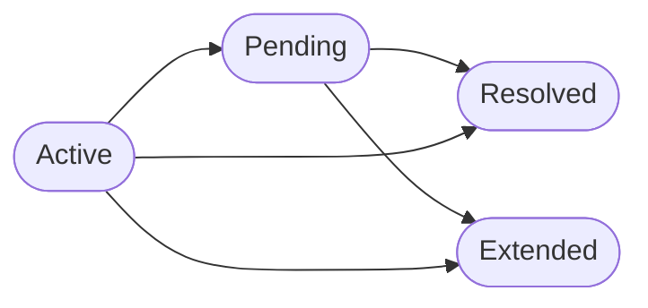

After a review is classified, HCIMS AI immediately routes it to one of five operational departments. Routing is driven by the same ML model that performs classification — the system finds the training complaint most similar to the submitted review and inherits its department label. Once routed, a ticket enters a managed lifecycle with status transitions, deadline tracking, and role-based visibility so that every staff member only sees the work assigned to their team.

## The five departments

Every complaint is assigned to one of the following departments. The table below shows each department and the categories of issues it handles.

| Department | Typical complaint categories |
|------------|------------------------------|
| **Housekeeping** | Dirty rooms, unmade beds, missing towels, stained linen, pest issues |
| **Engineering & Maintenance** | AC not working, broken fixtures, water leaks, electrical faults, elevator issues |
| **Food & Beverage** | Cold or stale food, wrong orders, slow room service, breakfast quality |
| **IT Support** | Wi-Fi not connecting, slow internet, TV or in-room device failures |
| **Front Office** | Slow check-in, billing errors, key card issues, noise complaints, lost items |

<Tip>
  Routing accuracy improves as your training data grows. Uploading batches of real guest reviews through CSV helps the model surface closer matches for unusual complaint types.
</Tip>

## How routing works

The ML model does not learn a separate classifier for each department. Instead, it relies on the same **cosine similarity search** used during classification:

<Steps>
  <Step title="Embed and compare">
    The review is encoded by `all-MiniLM-L6-v2` into a 384-dimensional vector. Cosine similarity is computed against every complaint embedding in the training set.
  </Step>
  <Step title="Select the nearest complaint">
    The training complaint with the highest similarity score is chosen. Its `department` field becomes the routed department for the new ticket.
  </Step>
  <Step title="Write the ticket">
    The complaint is inserted into Supabase with the resolved `department`, `priority`, and `status: "Active"`. The `uploaded_by_admin_id` field links the ticket to the admin account that submitted the review.
  </Step>
</Steps>

## Ticket status lifecycle

A ticket moves through a defined set of statuses from creation to closure. Status is computed dynamically from the `deadline` and `resolved_at` fields rather than stored as a fixed string, which means the status always reflects the real-world state of the ticket.

| Status | Meaning |
|--------|---------|
| **Active** | Ticket is open and within its deadline window |
| **Pending** | Ticket has passed its deadline without resolution |
| **Resolved** | Staff submitted a verified proof image and resolution notes |
| **Extended** | Ticket was resolved after the deadline had already passed |

<Note>
  Staff cannot manually set a status. Transitions happen automatically as deadlines pass or as proof-based resolution is submitted. See [Proof validation](/features/proof-validation) for how resolution is verified.
</Note>

## Priority deadlines

Priority affects how quickly a ticket is expected to be resolved. High-priority tickets have tighter deadlines than low-priority ones, giving staff a clear visual indicator of urgency in the dashboard.

| Priority | Expected resolution window |
|----------|---------------------------|
| **High** | Shortest window — for critical issues such as leaks, broken AC, or non-functional equipment |
| **Medium** | Moderate window — for service delays and slower-than-expected responses |
| **Low** | Longest window — for general feedback with no immediate safety or comfort impact |

Once the deadline passes without a `resolved_at` timestamp, the computed status shifts from **Active** to **Pending**, and the ticket appears highlighted in the staff queue.

## Staff visibility and role isolation

Access to tickets is restricted by role and by the admin account that created the staff member.

<AccordionGroup>
  <Accordion title="department_staff role">
    Staff with the `department_staff` role can only see tickets that belong to their assigned department **and** were uploaded under the admin account that created their login. They cannot view tickets from other departments or from other hotel accounts.
  </Accordion>
  <Accordion title="admin role">
    Administrators see all tickets, appreciations, and analytics scoped to their own account. They can create, update, and delete staff accounts, and receive notifications when a proof upload is blocked by the AI detection system.
  </Accordion>
</AccordionGroup>

<Warning>
  Changing a staff member's department via `/update_staff` does not reassign their existing tickets. Tickets are linked to the department name at the time of upload, not to the staff user ID.
</Warning>

## Staff assignment

Admins create department staff accounts via the `/create_staff` endpoint. Each staff account is tagged with:

- `role: "department_staff"`
- `department`: one of the five department names above
- `created_by_admin_id`: the admin's user ID, used to scope ticket visibility

A staff member logs in with their email and password and immediately sees the Active and Pending tickets for their department without any additional configuration.

<CardGroup cols={2}>
  <Card title="Complaint classification" icon="brain" href="/features/complaint-classification">
    Understand how reviews are classified before routing begins.
  </Card>
  <Card title="Proof validation" icon="shield-check" href="/features/proof-validation">
    Learn how staff prove resolution with verified images.
  </Card>
</CardGroup>
